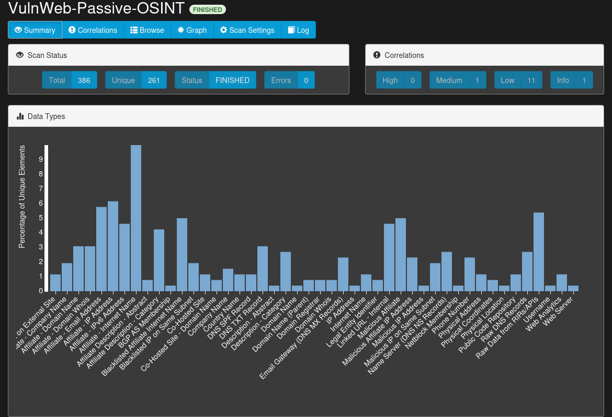
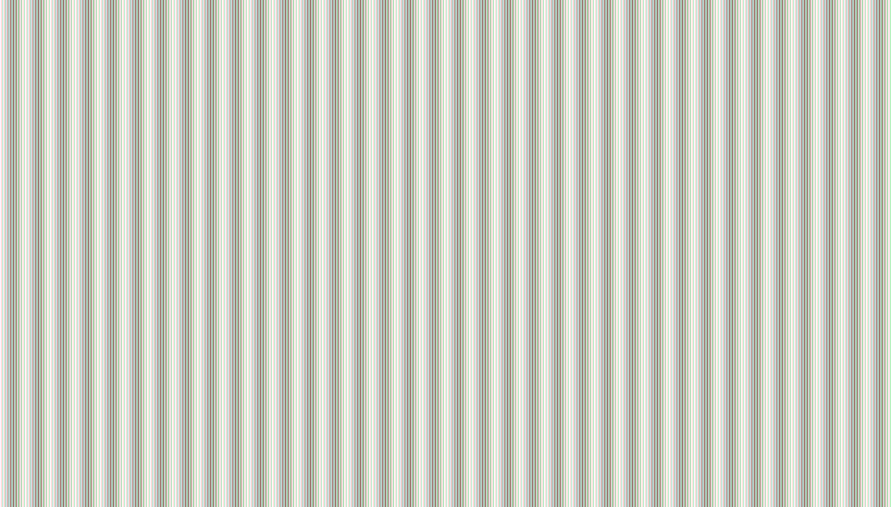

# OSINT Reconnaissance Report: vulnweb.com
**Target:** `testphp.vulnweb.com`  
**Tooling:** SpiderFoot (Passive Scan)  
**Analyst:** Brandon Jones

---

## 📊 Scan Visualizations

### Executive Summary
Below is the high-level data distribution captured during the passive reconnaissance phase. This highlights the diversity of data points retrieved, including DNS records and web content metadata.

### Entity Correlation Graph
This graph visualizes the relationship between the target domain, its hosted IP addresses, and associated network infrastructure.

---

## 📂 Data Exports
- [Full CSV Report](./spiderfoot_results.csv)
